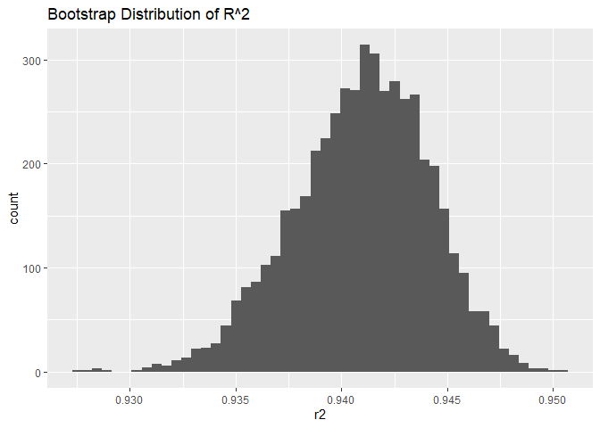
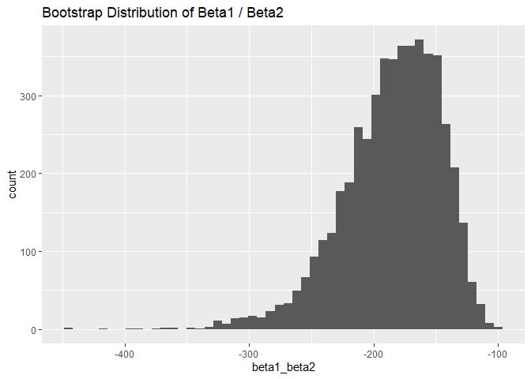
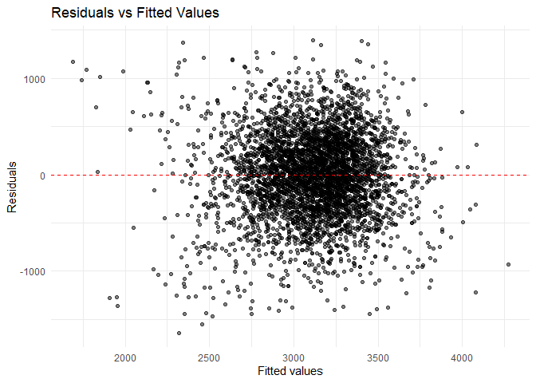
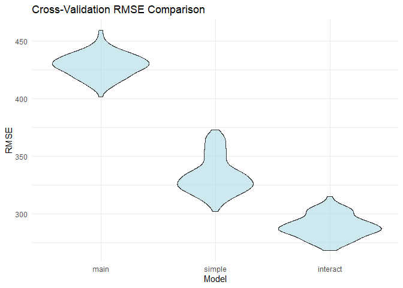

p8105_hw6_cz2955
================
2025-11-30

## Q1

### Data

``` r
killdata<-read_csv("homicide_data.csv")
```

    ## Rows: 52179 Columns: 12
    ## ── Column specification ────────────────────────────────────────────────────────
    ## Delimiter: ","
    ## chr (9): uid, victim_last, victim_first, victim_race, victim_age, victim_sex...
    ## dbl (3): reported_date, lat, lon
    ## 
    ## ℹ Use `spec()` to retrieve the full column specification for this data.
    ## ℹ Specify the column types or set `show_col_types = FALSE` to quiet this message.

``` r
head(killdata)
```

    ## # A tibble: 6 × 12
    ##   uid   reported_date victim_last victim_first victim_race victim_age victim_sex
    ##   <chr>         <dbl> <chr>       <chr>        <chr>       <chr>      <chr>     
    ## 1 Alb-…      20100504 GARCIA      JUAN         Hispanic    78         Male      
    ## 2 Alb-…      20100216 MONTOYA     CAMERON      Hispanic    17         Male      
    ## 3 Alb-…      20100601 SATTERFIELD VIVIANA      White       15         Female    
    ## 4 Alb-…      20100101 MENDIOLA    CARLOS       Hispanic    32         Male      
    ## 5 Alb-…      20100102 MULA        VIVIAN       White       72         Female    
    ## 6 Alb-…      20100126 BOOK        GERALDINE    White       91         Female    
    ## # ℹ 5 more variables: city <chr>, state <chr>, lat <dbl>, lon <dbl>,
    ## #   disposition <chr>

### Cleandata

``` r
clean_data <- killdata %>%
  mutate(city_state = paste0(city, ", ", state)) %>%
  mutate(solved = if_else(disposition == "Closed by arrest", 1, 0)) %>%
  filter(!(city_state %in% c("Dallas, TX", "Phoenix, AZ", 
                             "Kansas City, MO", "Tulsa, AL"))) %>%
  filter(victim_race %in% c("White", "Black")) %>%
  mutate(victim_age = as.numeric(victim_age))
```

    ## Warning: There was 1 warning in `mutate()`.
    ## ℹ In argument: `victim_age = as.numeric(victim_age)`.
    ## Caused by warning:
    ## ! NAs introduced by coercion

``` r
clean_data
```

    ## # A tibble: 39,693 × 14
    ##    uid        reported_date victim_last  victim_first victim_race victim_age
    ##    <chr>              <dbl> <chr>        <chr>        <chr>            <dbl>
    ##  1 Alb-000003      20100601 SATTERFIELD  VIVIANA      White               15
    ##  2 Alb-000005      20100102 MULA         VIVIAN       White               72
    ##  3 Alb-000006      20100126 BOOK         GERALDINE    White               91
    ##  4 Alb-000009      20100130 MARTIN-LEYVA GUSTAVO      White               56
    ##  5 Alb-000012      20100218 LUJAN        KEVIN        White               NA
    ##  6 Alb-000016      20100308 GRAY         STEFANIA     White               43
    ##  7 Alb-000018      20100323 DAVID        LARRY        White               52
    ##  8 Alb-000019      20100402 BRITO        ELIZABETH    White               22
    ##  9 Alb-000021      20100423 KING         TEVION       Black               15
    ## 10 Alb-000022      20100423 BOYKIN       CEDRIC       Black               25
    ## # ℹ 39,683 more rows
    ## # ℹ 8 more variables: victim_sex <chr>, city <chr>, state <chr>, lat <dbl>,
    ## #   lon <dbl>, disposition <chr>, city_state <chr>, solved <dbl>

### Baltimore, MD

``` r
Baltimore <- clean_data %>%
  filter(city == "Baltimore", state == "MD")
Baltimore
```

    ## # A tibble: 2,753 × 14
    ##    uid        reported_date victim_last victim_first  victim_race victim_age
    ##    <chr>              <dbl> <chr>       <chr>         <chr>            <dbl>
    ##  1 Bal-001607      20070101 NELSON      LEON          Black               17
    ##  2 Bal-001608      20070102 GOLF        EDDIE         Black               26
    ##  3 Bal-001609      20070105 MACKENNEY   THOMAS JOSEPH Black               21
    ##  4 Bal-001610      20070105 CANUPP      EDWARD LEE    White               61
    ##  5 Bal-001611      20070106 CUNNINGHAN  MICHAEL       Black               46
    ##  6 Bal-001612      20070106 ALSTON      RAY WILLIAM   Black               27
    ##  7 Bal-001613      20070107 HENDERSON   YULE ANTONIO  Black               21
    ##  8 Bal-001614      20070108 MCDOWELL    MARCU         Black               16
    ##  9 Bal-001615      20070108 GARDNER     RODNEY THOMAS Black               21
    ## 10 Bal-001616      20070108 BURNETTE    NELSENE       Black               44
    ## # ℹ 2,743 more rows
    ## # ℹ 8 more variables: victim_sex <chr>, city <chr>, state <chr>, lat <dbl>,
    ## #   lon <dbl>, disposition <chr>, city_state <chr>, solved <dbl>

``` r
model_balt <- glm(
  solved ~ victim_age + victim_sex + victim_race,
  data = Baltimore,
  family = binomial(link = "logit")
)
model_balt
```

    ## 
    ## Call:  glm(formula = solved ~ victim_age + victim_sex + victim_race, 
    ##     family = binomial(link = "logit"), data = Baltimore)
    ## 
    ## Coefficients:
    ##      (Intercept)        victim_age    victim_sexMale  victim_raceWhite  
    ##         0.309981         -0.006727         -0.854463          0.841756  
    ## 
    ## Degrees of Freedom: 2752 Total (i.e. Null);  2749 Residual
    ## Null Deviance:       3568 
    ## Residual Deviance: 3493  AIC: 3501

``` r
tidy_model <- tidy(model_balt, conf.int = TRUE, exponentiate = TRUE)
tidy_model
```

    ## # A tibble: 4 × 7
    ##   term             estimate std.error statistic  p.value conf.low conf.high
    ##   <chr>               <dbl>     <dbl>     <dbl>    <dbl>    <dbl>     <dbl>
    ## 1 (Intercept)         1.36    0.171        1.81 7.04e- 2    0.976     1.91 
    ## 2 victim_age          0.993   0.00332     -2.02 4.30e- 2    0.987     1.000
    ## 3 victim_sexMale      0.426   0.138       -6.18 6.26e-10    0.324     0.558
    ## 4 victim_raceWhite    2.32    0.175        4.82 1.45e- 6    1.65      3.28

``` r
male_or <- tidy_model %>% 
  filter(term == "victim_sexMale") %>%
  select(term, estimate, conf.low, conf.high)
male_or         
```

    ## # A tibble: 1 × 4
    ##   term           estimate conf.low conf.high
    ##   <chr>             <dbl>    <dbl>     <dbl>
    ## 1 victim_sexMale    0.426    0.324     0.558

``` r
cat("Adjusted OR (Male vs Female):", male_or$estimate, "\n")
```

    ## Adjusted OR (Male vs Female): 0.4255117

``` r
cat("95% CI: (", male_or$conf.low, ",", male_or$conf.high,")", "\n")
```

    ## 95% CI: ( 0.3241908 , 0.5575508 )

Ans: Using logistic regression with homicide resolution as the outcome
and victim age, sex, and race as predictors, the adjusted odds ratio
comparing male victims to female victims, while holding age and race
constant, is: the Adjusted OR is 0.4255117 and the 95% CI is (0.3241908,
0.5575508). This indicates that, given the same age and race, homicides
involving male victims are less likely to be solved compared to those
involving female victims.

### All cities

``` r
city_OR <- clean_data %>%
  nest(data = -c(city, state)) %>%
  mutate(
    model = purrr::map(data, ~ glm(
      solved ~ victim_age + victim_sex + victim_race,
      data = .x,
      family = binomial()
    )),
    tidy_res = map(model, ~ tidy(.x, conf.int = TRUE, exponentiate = TRUE)),
    male_or = purrr::map(tidy_res, ~ .x %>%
                    filter(term == "victim_sexMale") %>%
                    select(estimate, conf.low, conf.high))
  ) %>%
  unnest(male_or) %>%
  select(city, state, estimate, conf.low, conf.high) %>% 
  arrange(city)
```

    ## Warning: There were 43 warnings in `mutate()`.
    ## The first warning was:
    ## ℹ In argument: `tidy_res = map(model, ~tidy(.x, conf.int = TRUE, exponentiate =
    ##   TRUE))`.
    ## Caused by warning:
    ## ! glm.fit: fitted probabilities numerically 0 or 1 occurred
    ## ℹ Run `dplyr::last_dplyr_warnings()` to see the 42 remaining warnings.

``` r
city_OR 
```

    ## # A tibble: 47 × 5
    ##    city        state estimate conf.low conf.high
    ##    <chr>       <chr>    <dbl>    <dbl>     <dbl>
    ##  1 Albuquerque NM       1.77     0.825     3.76 
    ##  2 Atlanta     GA       1.00     0.680     1.46 
    ##  3 Baltimore   MD       0.426    0.324     0.558
    ##  4 Baton Rouge LA       0.381    0.204     0.684
    ##  5 Birmingham  AL       0.870    0.571     1.31 
    ##  6 Boston      MA       0.674    0.353     1.28 
    ##  7 Buffalo     NY       0.521    0.288     0.936
    ##  8 Charlotte   NC       0.884    0.551     1.39 
    ##  9 Chicago     IL       0.410    0.336     0.501
    ## 10 Cincinnati  OH       0.400    0.231     0.667
    ## # ℹ 37 more rows

### Plot

``` r
city_OR <- city_OR %>%
  arrange(estimate) %>%
  mutate(city = factor(city, levels = city))

ggplot(city_OR, aes(x = city, y = estimate)) +
  geom_point(color = "blue", size = 2) +
  geom_errorbar(aes(ymin = conf.low, ymax = conf.high), width = 0.3, color = "blue") +
  geom_hline(yintercept = 1, linetype = "dashed", color = "red") + 
  coord_flip() +  
  labs(
    x = "City",
    y = "Adjusted OR (Male vs Female)",
    title = "Adjusted Odds Ratios for Solving Homicides by City",
    subtitle = "OR < 1: Male victims less likely to be solved; OR > 1: Male victims more likely"
  ) +
  theme_minimal(base_size = 10)
```

<!-- -->

Ans: Form the plot we know that the OR of most cities are less than 1,
which means male victims less likely to be solved than female in many
cities. As most OR values fall between 0.5 and 1.0, the clearance rate
for male victim cases is generally lower across cities compared to
female victim cases. This leads us to the overall conclusion that,
within this dataset, homicide cases involving female victims typically
have a higher probability of being solved.

## Q2

### Import Data

``` r
library(p8105.datasets)
data("weather_df")
```

### Ready

``` r
set.seed(123)

boot_fn <- function(data) {
  
  boot_sample <- data %>% 
    slice_sample(n = nrow(data), replace = TRUE)
  
  fit <- lm(tmax ~ tmin + prcp, data = boot_sample)
  
  r2 <- glance(fit)$r.squared
  
  coef_tbl <- tidy(fit)
  beta1 <- coef_tbl$estimate[coef_tbl$term == "tmin"]
  beta2 <- coef_tbl$estimate[coef_tbl$term == "prcp"]
  
  tibble(
    r2 = r2,
    beta1_beta2 = beta1 / beta2
  )
}

weather_cleaned_df <- weather_df %>% 
  drop_na()

boot_results <- replicate(5000, boot_fn(weather_cleaned_df), simplify = FALSE) %>%
bind_rows()
head(boot_results)
```

    ## # A tibble: 6 × 2
    ##      r2 beta1_beta2
    ##   <dbl>       <dbl>
    ## 1 0.936       -158.
    ## 2 0.939       -217.
    ## 3 0.943       -159.
    ## 4 0.946       -196.
    ## 5 0.941       -142.
    ## 6 0.941       -142.

``` r
summary(boot_results$r2)
```

    ##    Min. 1st Qu.  Median    Mean 3rd Qu.    Max. 
    ##  0.9275  0.9389  0.9411  0.9409  0.9432  0.9505

``` r
summary(boot_results$beta1_beta2)
```

    ##    Min. 1st Qu.  Median    Mean 3rd Qu.    Max. 
    ## -445.24 -208.87 -180.46 -185.49 -156.22  -99.44

### r^2

``` r
library(ggplot2)

boot_results %>%
  ggplot(aes(x = r2)) +
  geom_histogram(bins = 50) +
  labs(title = "Bootstrap Distribution of R^2")   
```

<!-- -->

``` r
quantile(boot_results$r2, c(0.025, 0.975))
```

    ##      2.5%     97.5% 
    ## 0.9343890 0.9466496

Ans:Here is the plot of distribution for R^2. We can see in most of the
Beta Ratio estimate is between 0.93 to 0.95, and the most account is
approximate around 0.942. Moreover, the 95% Ci is (0.9344957 ,
0.9467211).

### Beta

``` r
boot_results %>%
  ggplot(aes(x = beta1_beta2)) +
  geom_histogram(bins = 50) +
  labs(title = "Bootstrap Distribution of Beta1 / Beta2")
```

<!-- -->

``` r
quantile(boot_results$beta1_beta2, c(0.025, 0.975))
```

    ##      2.5%     97.5% 
    ## -277.1703 -125.7063

Ans:Here is the plot of distribution for Beta1 / Beta2. We can see in
most of the Beta Ratio estimate is between -300 to -100, and the most
account is approximate around -175. Moreover, the 95% Ci is (-274.7945 ,
-125.4836 ).

## Q3

### Data

``` r
birthweight<-read_csv("birthweight.csv")
```

    ## Rows: 4342 Columns: 20
    ## ── Column specification ────────────────────────────────────────────────────────
    ## Delimiter: ","
    ## dbl (20): babysex, bhead, blength, bwt, delwt, fincome, frace, gaweeks, malf...
    ## 
    ## ℹ Use `spec()` to retrieve the full column specification for this data.
    ## ℹ Specify the column types or set `show_col_types = FALSE` to quiet this message.

``` r
birth_df <- birthweight %>% 
  mutate(
    babysex = factor(babysex, labels = c("Male", "Female")),
    frace = factor(frace),
    mrace = factor(mrace),
    malform = factor(malform)
  ) %>%
  drop_na(bwt, bhead, blength, gaweeks, delwt, ppwt, wtgain)
```

### Model

``` r
main_model <- lm(
  bwt ~ ppwt + gaweeks + wtgain + babysex + mrace,
  data = birth_df
)

summary(main_model)
```

    ## 
    ## Call:
    ## lm(formula = bwt ~ ppwt + gaweeks + wtgain + babysex + mrace, 
    ##     data = birth_df)
    ## 
    ## Residuals:
    ##      Min       1Q   Median       3Q      Max 
    ## -1638.71  -265.41     5.01   280.57  1392.22 
    ## 
    ## Coefficients:
    ##                Estimate Std. Error t value Pr(>|t|)    
    ## (Intercept)    371.7298    92.0942   4.036 5.52e-05 ***
    ## ppwt             4.6524     0.3284  14.167  < 2e-16 ***
    ## gaweeks         53.5144     2.1344  25.073  < 2e-16 ***
    ## wtgain           9.6760     0.6057  15.976  < 2e-16 ***
    ## babysexFemale  -82.8022    13.0749  -6.333 2.65e-10 ***
    ## mrace2        -248.0147    13.7639 -18.019  < 2e-16 ***
    ## mrace3         -24.0251    66.5549  -0.361  0.71813    
    ## mrace4        -104.1606    29.2879  -3.556  0.00038 ***
    ## ---
    ## Signif. codes:  0 '***' 0.001 '**' 0.01 '*' 0.05 '.' 0.1 ' ' 1
    ## 
    ## Residual standard error: 429.7 on 4334 degrees of freedom
    ## Multiple R-squared:  0.2971, Adjusted R-squared:  0.296 
    ## F-statistic: 261.7 on 7 and 4334 DF,  p-value: < 2.2e-16

### Plot

``` r
birth_df <- birth_df %>%
  add_predictions(main_model) %>%
  add_residuals(main_model)

ggplot(birth_df, aes(x = pred, y = resid)) +
  geom_point(alpha = 0.5) +
  geom_hline(yintercept = 0, color = "red", linetype = "dashed") +
  labs(x = "Fitted values", y = "Residuals",
       title = "Residuals vs Fitted Values") +
  theme_minimal()
```

<!-- -->
\### Other models

``` r
cv_df <- crossv_mc(birth_df, 100) |> 
  mutate(
    train = map(train, as_tibble),
    test  = map(test, as_tibble)
  )

cv_df <- cv_df |> 
  mutate(
    mod_main      = map(train, ~ lm(bwt ~ ppwt + gaweeks + wtgain + babysex + mrace, data = .x)),
    mod_simple    = map(train, ~ lm(bwt ~ blength + gaweeks, data = .x)),
    mod_interact  = map(train, ~ lm(bwt ~ (bhead + blength + babysex)^3, data = .x))
  )

cv_df <- cv_df |> 
  mutate(
    rmse_main      = map2_dbl(mod_main, test, ~ sqrt(mean((.y$bwt - predict(.x, .y))^2))),
    rmse_simple    = map2_dbl(mod_simple, test, ~ sqrt(mean((.y$bwt - predict(.x, .y))^2))),
    rmse_interact  = map2_dbl(mod_interact, test, ~ sqrt(mean((.y$bwt - predict(.x, .y))^2)))
  )

cv_df |>
select(starts_with("rmse")) |>
pivot_longer(
everything(),
names_to = "model",
values_to = "rmse",
names_prefix = "rmse_"
) |>
mutate(model = fct_inorder(model)) |>
ggplot(aes(x = model, y = rmse)) +
geom_violin(fill = "lightblue", alpha = 0.6) +
labs(
title = "Cross-Validation RMSE Comparison",
x = "Model",
y = "RMSE"
) +
theme_minimal()
```

<!-- -->
